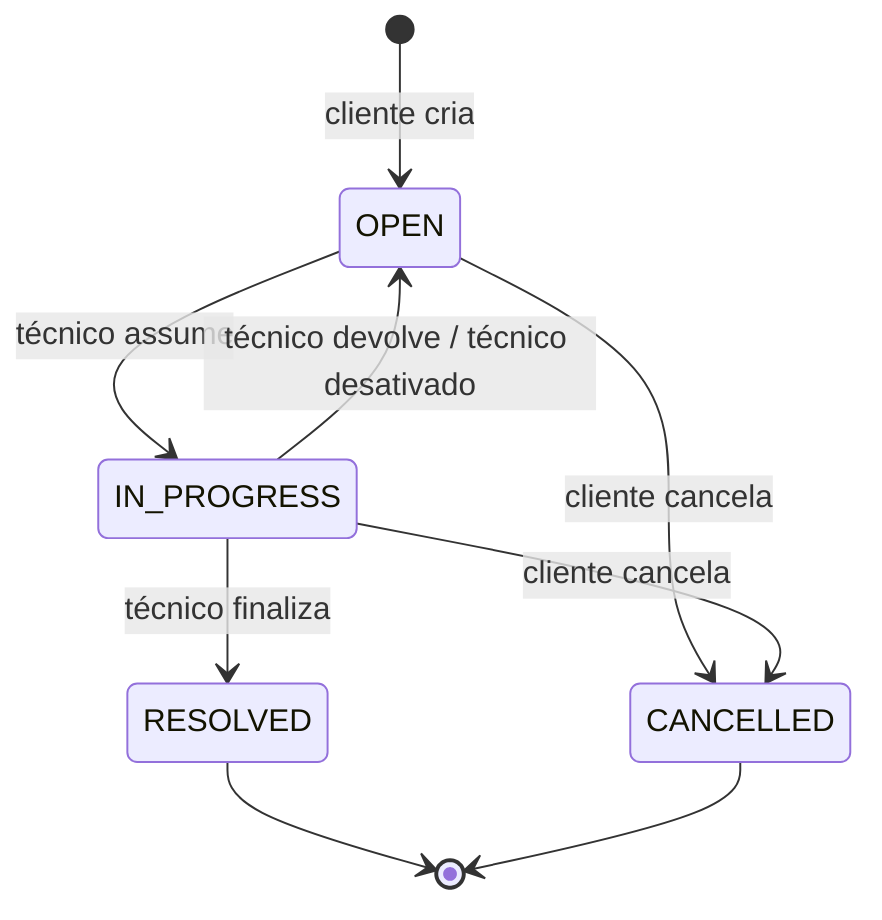

# 🛠️ API de Chamados (Help Desk)

API REST para **gerenciamento de chamados de suporte técnico**, construída com **TypeScript, Node.js, Express e MySQL puro**. Clientes abrem chamados, técnicos os assumem e resolvem, e o superusuário administra a equipe. Tudo com autenticação por cookies `httpOnly`, notificações em tempo real, auditoria e regras de negócio protegidas até dentro do banco de dados.

> Projeto de portfólio com foco em **arquitetura em camadas, segurança, testes que provam comportamento e boas práticas de engenharia**.

| | |
|---|---|
| 🖥️ **Frontend (React + Vite)** | https://github.com/Rafael-be/Front-API-chamados |
| 🚀 **API em produção (Render)** | `https://SEU-SERVICO.onrender.com` *(preencher após o deploy)* |
| 🌐 **Aplicação (Vercel)** | `https://SEU-APP.vercel.app` *(preencher após o deploy)* |
| 📚 **Documentação Swagger** | `https://SEU-SERVICO.onrender.com/api/docs` *(preencher após o deploy)* |
| 🗄️ **Banco de dados** | MySQL 8 no Aiven *(plano gratuito)* |

> ⏳ A API roda no plano gratuito do Render e pode "dormir" por inatividade. A primeira requisição pode demorar para acordar o servidor. O frontend exibe um estado de "acordando o servidor" para isso.

---

## 📌 Sumário

1. [Destaques técnicos](#-destaques-técnicos)
2. [Funcionalidades](#-funcionalidades)
3. [Stack](#-stack)
4. [Arquitetura](#-arquitetura)
5. [Modelo de dados](#-modelo-de-dados)
6. [Ciclo de vida do chamado](#-ciclo-de-vida-do-chamado)
7. [Autenticação e sessão](#-autenticação-e-sessão)
8. [Segurança](#-segurança)
9. [Tratamento de erros](#-tratamento-de-erros)
10. [Tempo real (Socket.IO)](#-tempo-real-socketio)
11. [Endpoints](#-endpoints)
12. [Testes](#-testes)
13. [Git e commits](#-git-e-commits)
14. [Como rodar localmente](#-como-rodar-localmente)
15. [Variáveis de ambiente](#-variáveis-de-ambiente)
16. [Deploy](#-deploy)
17. [Roadmap](#-roadmap)
18. [Autor](#-autor)

---

## ✨ Destaques técnicos

O que este projeto demonstra:

- **Arquitetura em camadas** (`routes → controllers → services → repositories`) com **injeção de dependência manual**, sem monólito, e padrões de projeto aplicados com propósito: Repository, Service, Observer, Strategy, Factory, Mapper e Unit of Work.
- **MySQL puro, sem ORM**, com **procedures e triggers** que garantem atomicidade e integridade mesmo se a API falhar (ex.: dois técnicos tentando assumir o mesmo chamado; um chamado finalizado é imutável **no banco**).
- **TDD de verdade:** testes escritos antes da implementação, com **repositórios fake em memória validados por suíte de contrato**, testes de integração com MySQL real em Docker e **mutation testing (Stryker)** para provar que os testes não são decorativos.
- **Sessão que não cai à toa:** access token JWT curto + **refresh token opaco rotativo** (hash no banco), cookies `httpOnly`, sessão deslizante de 30 dias, **janela de tolerância** para refreshes concorrentes e **detecção de reuso** com revogação da família de tokens.
- **Tempo real** com Socket.IO autenticado por **ticket de uso único** e **notificações persistidas** (nada se perde se o usuário estava offline).
- **Hierarquia de erros com códigos estáveis** e mensagens amigáveis em português, pensada para o frontend tratar cada caso sem depender de texto.
- **Rate limit** em rotas sensíveis contra força bruta, **auditoria** de ações de negócio e **logs estruturados** com `requestId` e dados sensíveis redigidos.
- **Paginação em todas as listagens**, busca por título e contadores por aba.
- **Processo profissional:** Conventional Commits impostos por `husky + commitlint`, fluxo `main ← develop ← feature branches`, CI no GitHub Actions e Docker multi-stage.
- **Documentação:** TSDoc, OpenAPI/Swagger gerado a partir dos schemas Zod (uma única fonte de verdade) e coleção Postman completa.

---

## 🎯 Funcionalidades

### 👤 Cliente
- Cadastro público (setor opcional) e login.
- Home com 4 abas: **todos, abertos, em manutenção e resolvidos**, paginadas e com **busca por título**.
- Abrir chamado (título, descrição, horário automático). O **setor do cliente na criação** fica registrado no chamado.
- **Editar** o chamado enquanto estiver aberto e **cancelar** a qualquer momento (aberto ou em andamento). Chamado cancelado some das listas e permanece na auditoria.
- Ver detalhes, **comentar e responder** (1 nível), **editar e excluir os próprios comentários**.
- Ver os dados do técnico responsável (nome, setor, e-mail).
- Perfil: alterar nome, setor, e-mail e senha (e-mail e senha exigem a senha atual).
- **Notificações em tempo real**: técnico assumiu, devolveu, finalizou, novo comentário.
- Chamado finalizado fica **totalmente imutável**, incluindo a nota de resolução do técnico (opcional).

### 🔧 Técnico
- **Fila** de chamados abertos (mais antigos primeiro), com filtro por setor e busca.
- **Meus chamados** (em andamento) e **finalizados por mim**, paginados.
- **Assumir**, **devolver à fila** e **finalizar** (com nota opcional).
- Comentar e responder nos chamados que assumiu. Chamados abertos podem ser vistos em modo leitura antes de assumir.
- Perfil: alterar nome, e-mail e senha. Troca de senha obrigatória no primeiro acesso.
- Notificação em tempo real quando o cliente cancela um chamado ou comenta.

### 🛡️ Superusuário
- Conta única criada por **script de seed** (credenciais no `.env`).
- **Criar técnicos** (nome, e-mail, senha inicial, setor) e **listar** com estatísticas: chamados assumidos (histórico), em andamento e finalizados.
- Alterar o **setor** do técnico, **ativar/desativar** e **resetar a senha** para a senha padrão.
- **Desativar um técnico** devolve seus chamados em andamento à fila e notifica os clientes afetados.
- **Gerenciar setores** (criar, renomear, ativar/desativar).

---

## 🧰 Stack

| Área | Tecnologia |
|---|---|
| Linguagem | TypeScript (modo `strict`) |
| Runtime / Framework | Node.js 20+ · Express |
| Banco de dados | MySQL 8 · `mysql2` (sem ORM) · triggers e procedures |
| Migrations | Umzug com arquivos `.sql` versionados |
| Validação | Zod |
| Autenticação | JWT · bcrypt · refresh token rotativo |
| Segurança | Helmet · CORS · cookies `httpOnly` · rate limit · checagem de `Origin` |
| Tempo real | Socket.IO |
| Logs | Pino · pino-http |
| Testes | Jest · ts-jest · Supertest · socket.io-client · Stryker |
| Qualidade | ESLint · Prettier · Husky · Commitlint |
| Documentação | TSDoc · OpenAPI/Swagger · Postman |
| Infra | Docker · GitHub Actions · Render · Aiven · Vercel (frontend) |

---

## 🏗️ Arquitetura

```
Requisição → Middlewares → Routes → Controllers → Services → Repositories → MySQL
                                                      │
                                                      └─► EventBus ─► Listeners ─► Socket.IO
```

| Camada | Responsabilidade |
|---|---|
| `routes` | Declara rotas e encadeia middlewares (rate limit, auth, papel, validação) |
| `controllers` | Traduz HTTP ↔ service. Sem regra de negócio |
| `services` | Regras de negócio, orquestração e transações |
| `repositories` | Todo o SQL. Interfaces + implementação MySQL |
| `domain` | Máquina de estados do chamado e **políticas de permissão por papel** (Strategy) |
| `models` / `dtos` / `mappers` | Tipos de domínio, contratos de entrada/saída (Zod) e conversão `snake_case ↔ camelCase` |
| `errors` | `AppError` e subclasses, com fábrica de erros |
| `events` / `sockets` | EventBus (Observer) e entrega de notificações em tempo real |

```
src/
├─ config/  domain/  models/  dtos/  mappers/  errors/
├─ repositories/ (interfaces + mysql)  services/  controllers/  routes/
├─ middlewares/  events/  sockets/  utils/
├─ app.ts (createApp(deps))   container.ts (composition root)   server.ts
db/ (migrations, seeds, schema.sql)   scripts/   tests/   docs/
```

**Decisões de design:**
- `createApp(deps)` recebe as dependências, então os testes substituem repositórios por fakes sem tocar no código.
- Operações críticas rodam em **transação** (Unit of Work), e o ator da ação é informado ao banco para os triggers auditarem corretamente.
- A emissão no socket só acontece **depois do commit**, evitando notificar algo que foi revertido.

---

## 🗄️ Modelo de dados

| Tabela | Papel |
|---|---|
| `users` | Clientes, técnicos e o superusuário (`role`), com `is_active` e `must_change_password` |
| `sectors` | Setores (ativar/desativar, nunca apagar) |
| `tickets` | Chamados, com setor registrado no momento da criação |
| `ticket_comments` | Comentários e respostas de 1 nível, com edição e soft delete |
| `notifications` | Notificações persistidas (lido/não lido) |
| `refresh_tokens` | Hashes dos refresh tokens, com família para detecção de reuso |
| `technician_stats` | Contadores por técnico, mantidos por trigger |
| `audit_logs` | Trilha de auditoria (ações de negócio) |

**Lógica no banco:**

| Objeto | O que garante |
|---|---|
| `sp_assume_ticket` | Apenas um técnico assume cada chamado, mesmo sob concorrência |
| `sp_return_ticket` · `sp_finish_ticket` · `sp_cancel_ticket` | Transições válidas e donos corretos |
| `sp_deactivate_technician` | Desativa, devolve chamados à fila e revoga sessões numa única operação atômica |
| Trigger `BEFORE UPDATE` em `tickets` | Chamados `RESOLVED`/`CANCELLED` são imutáveis, e só transições válidas passam |
| Trigger `AFTER UPDATE` em `tickets` | Auditoria da mudança de status e atualização das estatísticas |
| Triggers em `ticket_comments` | Respostas só de 1 nível, só em chamados ativos, e histórico das edições |

O arquivo [`db/schema.sql`](db/schema.sql) mantém o **snapshot consolidado** de tabelas, índices, procedures e triggers, e um teste de integração garante que ele é equivalente às migrations.

---

## 🔄 Ciclo de vida do chamado



`RESOLVED` e `CANCELLED` são **estados finais**: nada mais pode ser feito, e isso é garantido tanto no service quanto por trigger.

---

## 🔐 Autenticação e sessão

- **Access token** (JWT, 15 min) e **refresh token** opaco (256 bits, 30 dias) em cookies `httpOnly`, `Secure` em produção, `SameSite=Lax`.
- O refresh token é guardado como **hash SHA-256** no banco, então sobrevive a reinícios do servidor e pode ser revogado.
- **Sessão deslizante:** cada renovação gera um novo refresh e estende os 30 dias. Quem usa o sistema não precisa logar de novo.
- **Janela de tolerância (~20 s)** para refreshes simultâneos (duas abas, resposta perdida) sem derrubar a sessão. **Reuso fora da janela** revoga toda a família de tokens e é registrado na auditoria.
- O middleware revalida o usuário a cada requisição, então **desativar uma conta tem efeito imediato**.
- Senhas com **bcrypt**. Política: mínimo 8 caracteres, com letra e número. Troca de senha exige a atual e encerra as outras sessões.
- Em produção, o frontend usa **proxy de rewrite da Vercel** (`/api/*` → API), então o cookie é *first-party* e funciona em todos os navegadores sem domínio próprio.

---

## 🛡️ Segurança

| Medida | Detalhe |
|---|---|
| Cookies | `httpOnly`, `Secure`, `SameSite=Lax`, sem `Domain`, `Max-Age` explícito |
| CSRF | `SameSite` + JSON obrigatório + validação do header `Origin` |
| CORS | Whitelist por variável de ambiente, com credenciais |
| Rate limit | Login, registro, refresh, troca de senha/e-mail, ações administrativas e comentários |
| Cabeçalhos | Helmet |
| Senhas | bcrypt; respostas e tempos iguais para e-mail inexistente e senha errada |
| Entrada | Validação Zod em toda rota; limite de tamanho do corpo |
| Erros | Stack e detalhes internos **nunca** vazam para o cliente |
| Logs | `redact` de senhas, tokens, hashes e cookies |
| Autorização | Políticas por papel testadas em tabela, mais triggers como rede de segurança no banco |

---

## ⚠️ Tratamento de erros

Todos os erros passam por um **handler central** e saem no mesmo formato:

```json
{
  "success": false,
  "error": {
    "code": "TICKET_ALREADY_RESOLVED",
    "message": "Este chamado já foi finalizado e não pode mais ser alterado.",
    "details": null
  },
  "requestId": "b6f1c0e2-..."
}
```

- **Códigos estáveis em inglês** (o frontend decide o comportamento pelo código) e **mensagens em português**.
- Cobertura de: validação (Zod, com detalhes por campo), JSON malformado, JWT expirado/inválido, refresh reutilizado, duplicidades e violações do MySQL, erros lançados pelas procedures (`SIGNAL`), deadlocks, queda do banco, rate limit (com `retryAfter`), rota inexistente, corpo grande demais e erros inesperados.
- O processo trata `unhandledRejection`, `uncaughtException` e `SIGTERM` com **encerramento gracioso**.

---

## 🔔 Tempo real (Socket.IO)

- O socket conecta direto na API (o proxy da Vercel não repassa WebSocket) e autentica com um **ticket de uso único (~30 s)** obtido via REST.
- Cada usuário entra na sua própria room e recebe `notification:new`.
- **Eventos:** chamado assumido, devolvido, finalizado, cancelado, técnico desativado e novo comentário/resposta.
- As notificações são **persistidas**: ao reconectar, o frontend busca as não lidas por REST. O contador de não lidas e a ação de marcar como lida (uma ou todas) estão disponíveis.

---

## 🌐 Endpoints

Prefixo `/api/v1`. Listagens aceitam `page` e `limit` (máximo 50) e retornam `meta` com `total`, `totalPages` e `hasNext`.

| Grupo | Rotas |
|---|---|
| Público | `GET /health` · `GET /sectors` |
| Auth | `POST /auth/register` · `/login` · `/refresh` · `/logout` |
| Perfil | `GET /me` · `PATCH /me` · `PATCH /me/email` · `PATCH /me/password` |
| Chamados (cliente) | `POST /tickets` · `GET /tickets` · `GET /tickets/counts` · `PATCH /tickets/:id` · `POST /tickets/:id/cancel` |
| Chamados (técnico) | `GET /technician/tickets?view=queue\|mine\|done` · `POST /tickets/:id/assume` · `/return` · `/finish` |
| Detalhe | `GET /tickets/:id` |
| Comentários | `GET`/`POST /tickets/:id/comments` · `PATCH`/`DELETE /comments/:id` |
| Notificações | `GET /notifications` · `/unread-count` · `PATCH /:id/read` · `PATCH /read-all` · `POST /socket-ticket` |
| Admin | `POST`/`GET /admin/technicians` · `PATCH /admin/technicians/:id` · `/status` · `/reset-password` · `GET`/`POST`/`PATCH /admin/sectors` |

Documentação interativa em `/api/docs` (Swagger) e coleção em [`docs/postman/`](docs/postman).

---

## 🧪 Testes

**Três níveis:**

| Nível | Foco | Ambiente |
|---|---|---|
| Unitário | Regras de negócio, máquina de estados, políticas de permissão, utilitários, middlewares | Repositórios fake em memória |
| Integração de banco | Migrations, procedures, triggers, concorrência (dois `assume` simultâneos) e equivalência `schema.sql` ≡ migrations | MySQL 8 real em Docker |
| HTTP e Socket | Fluxo completo cadastro → chamado → atendimento → resolução, cookies e sessão, notificações em tempo real | Supertest + socket.io-client |

**Por que confiar nos testes:**
- Escritos **antes** da implementação (commit `test:` precede o `feat:`).
- Cada teste confere o **resultado e o estado final** (ex.: um `assume` rejeitado não altera o chamado).
- Os fakes passam pela **mesma suíte de contrato** dos repositórios MySQL.
- **Mutation testing (Stryker)** nos services e no domínio, meta ≥ 70% de mutantes mortos e ≥ 85% de cobertura.

```bash
npm test                # unitários
npm run test:integration # banco (exige o MySQL de teste no ar)
npm run test:http       # ponta a ponta
npm run test:mutation   # Stryker
npm run test:coverage   # cobertura
```

---

## 🌿 Git e commits

- Fluxo: **`main`** (estável/deploy) ← **`develop`** ← branches de trabalho (`feat/…`, `fix/…`, `test/…`, `db/…`, `docs/…`, `chore/…`, `refactor/…`), sempre criadas a partir da `develop` e integradas por PR com merge `--no-ff`.
- **Conventional Commits** com escopo, impostos por **husky + commitlint**:

```
test(tickets): add state machine transition table
feat(tickets): implement ticket state machine
db(migrations): add sp_assume_ticket procedure
feat(auth): rotate refresh tokens with grace window
```

- CI no GitHub Actions executa lint, build e testes a cada push/PR.

---

## 🚀 Como rodar localmente

**Pré-requisitos:** Node.js 20+, MySQL 8 (ex.: MySQL Workbench/Server local) e Docker (para o banco de testes).

```bash
# 1. Clonar e instalar
git clone https://github.com/Rafael-be/API-de-gerenciamento-de-chamados.git   # ajuste para a URL real do repositório
cd API-de-gerenciamento-de-chamados
npm install

# 2. Variáveis de ambiente
cp .env.example .env     # edite os valores (segredos, superusuário, banco)

# 3. Banco de dados local (execute no MySQL Workbench como root)
```

```sql
CREATE DATABASE IF NOT EXISTS helpdesk CHARACTER SET utf8mb4 COLLATE utf8mb4_0900_ai_ci;
CREATE USER IF NOT EXISTS 'helpdesk_user'@'%' IDENTIFIED BY 'helpdesk_pass';
GRANT ALL PRIVILEGES ON helpdesk.* TO 'helpdesk_user'@'%';
FLUSH PRIVILEGES;
SET GLOBAL log_bin_trust_function_creators = 1;  -- necessário para criar triggers/procedures
```

```bash
# 4. Migrations e seeds
npm run db:migrate
npm run seed:superuser

# 5. Subir a API
npm run dev              # http://localhost:3000/api/v1

# 6. Banco de testes e testes
docker compose up -d mysql-test
npm test
```

O frontend em desenvolvimento roda em `http://localhost:5173` (Vite), que já está na whitelist de CORS padrão.

---

## ⚙️ Variáveis de ambiente

| Variável | Descrição | Exemplo |
|---|---|---|
| `NODE_ENV` · `PORT` · `LOG_LEVEL` | Execução e nível de log | `development` · `3000` · `debug` |
| `DB_HOST` · `DB_PORT` · `DB_USER` · `DB_PASSWORD` · `DB_NAME` | Conexão MySQL | `127.0.0.1` · `3306` · … |
| `DB_POOL_LIMIT` | Tamanho do pool | `10` |
| `DB_SSL` · `DB_SSL_CA` | SSL e certificado CA (Aiven) | `false` · *(vazio local)* |
| `TEST_DB_*` | Banco de testes (Docker, porta 3307) | `helpdesk_test` |
| `JWT_ACCESS_SECRET` · `JWT_ACCESS_TTL` | Assinatura e validade do access token | *(segredo longo)* · `15m` |
| `REFRESH_TTL_DAYS` · `REFRESH_GRACE_SECONDS` | Validade do refresh e janela de tolerância | `30` · `20` |
| `BCRYPT_ROUNDS` | Custo do bcrypt | `12` |
| `COOKIE_SECURE` | `true` em produção | `false` |
| `CORS_ORIGINS` | Origens permitidas (separadas por vírgula) | `http://localhost:5173` |
| `TRUST_PROXY` | Confiar no proxy (produção) | `false` |
| `SOCKET_TICKET_TTL_SECONDS` | Validade do ticket do socket | `30` |
| `SUPERUSER_NAME` · `SUPERUSER_EMAIL` · `SUPERUSER_PASSWORD` | Superusuário (seed) | — |
| `DEFAULT_RESET_PASSWORD` | Senha aplicada no reset de técnicos | `SenhaTeste123` |

---

## ☁️ Deploy

> Seção a preencher/atualizar durante o deploy.

| Componente | Serviço | Detalhes |
|---|---|---|
| API | **Render** (Docker) | URL: `https://SEU-SERVICO.onrender.com` · plano gratuito (hiberna por inatividade) |
| Banco | **Aiven for MySQL** | Plano gratuito · conexão com SSL e certificado CA por variável de ambiente |
| Frontend | **Vercel** | URL: `https://SEU-APP.vercel.app` · repositório: [Front-API-chamados](https://github.com/Rafael-be/Front-API-chamados) |

**Como front e API conversam em produção:**
- A Vercel reescreve `/api/*` para a API no Render (`vercel.json` com `rewrites`), então o navegador enxerga uma única origem e os cookies funcionam como *first-party*.
- O WebSocket conecta **direto** na API (a Vercel não repassa WebSocket), autenticado por ticket de uso único.
- Na API: `COOKIE_SECURE=true`, `TRUST_PROXY=1`, `CORS_ORIGINS` com a URL da Vercel e `DB_SSL=true`.

**Containerização:** `Dockerfile` multi-stage (build e runtime separados, usuário não-root, `HEALTHCHECK` em `/api/v1/health`).

**Limitações conhecidas do plano gratuito:** instância que hiberna (cold start), rate limit em memória que zera a cada reinício e recursos reduzidos no banco.

---

## 🗺️ Roadmap

- [ ] Etapa 0 — Fundação (TypeScript, Jest, lint, husky/commitlint, CI)
- [ ] Etapa 1 — Contratos e domínio
- [ ] Etapa 2 — Banco (migrations, procedures, triggers, seeds, `schema.sql`)
- [ ] Etapa 3 — Autenticação e sessão
- [ ] Etapa 4 — Usuários, perfil, setores e administração
- [ ] Etapa 5 — Chamados
- [ ] Etapa 6 — Comentários
- [ ] Etapa 7 — Notificações e Socket.IO
- [ ] Etapa 8 — Endurecimento e mutation testing
- [ ] Etapa 9 — Coleção Postman
- [ ] Etapa 10 — Documentação (TSDoc, Swagger, README final)
- [ ] Etapa 11 — Deploy (Render, Aiven, Vercel)

**Ideias futuras:** verificação de e-mail e "esqueci minha senha" por e-mail, anexos nos chamados, prioridade e categoria, Redis para rate limit e Socket.IO em múltiplas instâncias, painel de métricas.

---

## 👨‍💻 Autor

**Rafael** — [@Rafael-be](https://github.com/Rafael-be)

Frontend deste projeto: [Front-API-chamados](https://github.com/Rafael-be/Front-API-chamados)
